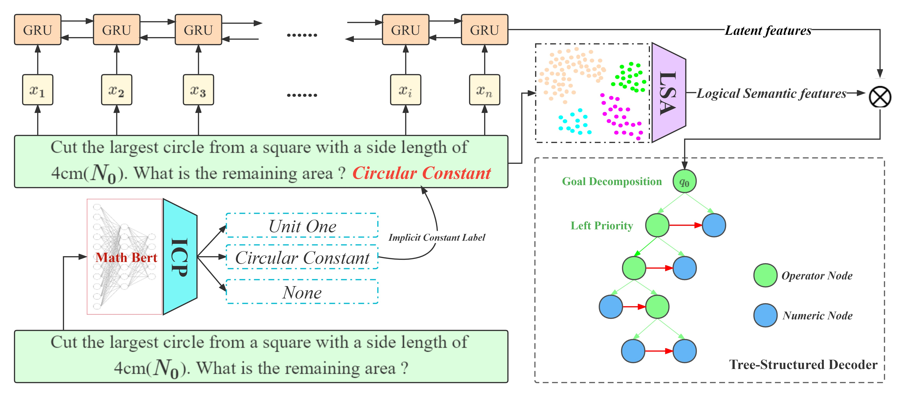

<!--居中打印-->
<h1 align="center"></h1>

  
 

 

# About Me 👋🥱🥱

- :ideograph_advantage: After military victory, there must be political victory
- :ideograph_advantage: Fitness and Meat lover :egg::egg::egg::cut_of_meat::cut_of_meat::cut_of_meat::milk_glass::milk_glass::milk_glass:
- 📫 How to reach me: haitao9833@outlook.com

<!--语言统计 + 数据统计-->

  
  

    

 

# MyPaper 📑🔖🔖
### 
《Improving Math Word Problems Solver with Logical Semantic Similarity》

<!-- 
# Star History 🌟
 

# About Me 👋🥱🥱

- :ideograph_advantage: After military victory, there must be political victory
- :ideograph_advantage: Fitness and Meat lover :egg::egg::egg::cut_of_meat::cut_of_meat::cut_of_meat::milk_glass::milk_glass::milk_glass:
- 📫 How to reach me: haitao9833@outlook.com
- 
-->

<!--
// 标题居中
# 
 About Me 👋🥱🥱

//配色
fce8d8,FCF4D9,fff4c5,F71E35
fce8d8,FCF4D9,fff4c5,A2FAA3
fff7f7,fae3d9,ffb6b9,ffeead
9BD7D5,87E293,AFEAAA,4FD5D6
e2f2d5,87E293,78fee0,d280f9
FE8402,87E293,AFEAAA,FF7260
// 待用
You are my 

  

-->
